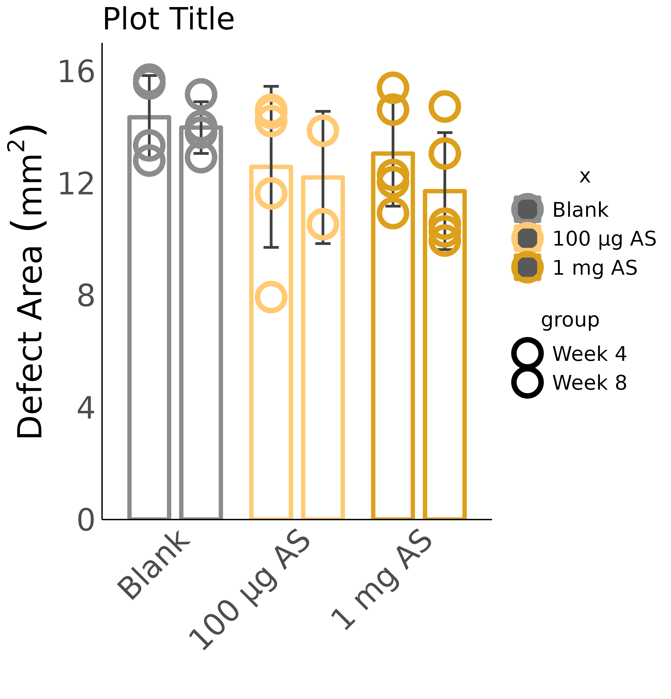

# Examples datascience-env

## Barplots

| [2 groups](barplots/barplot_2groups/barplot_2groups.ipynb) |  [Multiple groups](barplots/barplot_multiGroups/barplot_multiGroups.ipynb)    |  [Side-by-Side groups](barplots/barplot_side-by-side/barplot_side-by-side.ipynb)      |
|:-----------:|:------------:|:------------:|
|    |     |     |
